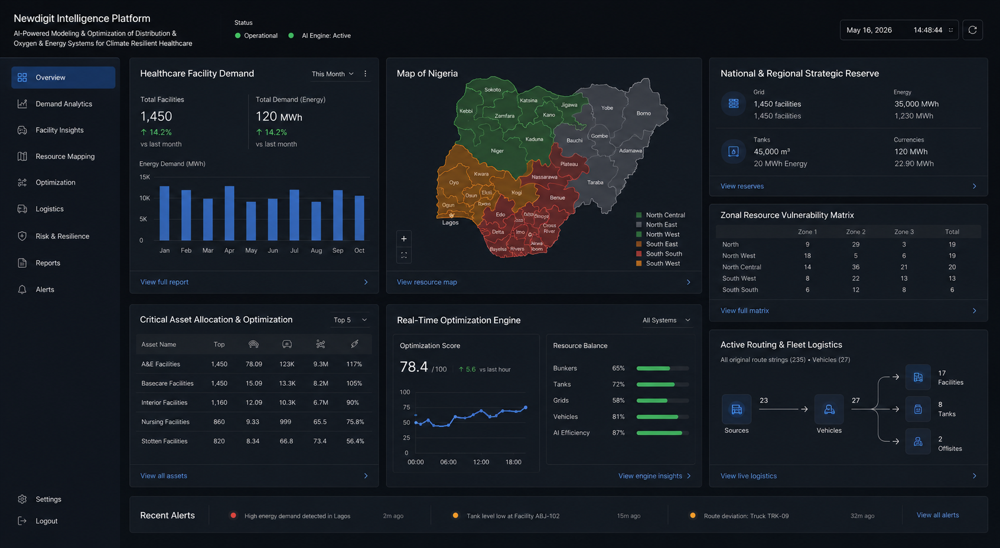

<div align="center">
   <h1 style="margin-bottom: 4px; font-size: 2.6rem;">Newdigit Oxygen Prediction System</h1>
   <h3 style="margin-top: 0; font-weight: 500;">AI Powered Modeling and Optimisation of Distributed Oxygen & Energy Intelligence System for Climate Resilient Healthcare</h3>
</div>

<p align="center">
  <a href="https://github.com/newdigit-git/oxygen-prediction" target="_blank">
    
  </a>
</p>

---

[](LICENSE)
[](https://www.who.int/)
[](#features--methods)
[](https://reactjs.org/)
[](https://tailwindcss.com/)
[](https://fastapi.tiangolo.com/)
[](https://www.python.org/)
[](https://www.postgresql.org/)
[](https://www.docker.com/)

---

## 📖 Table of Contents

1. [What is oxygen-prediction?](#what-is-oxygen-prediction)
2. [Features & Architecture](#features--architecture)
3. [Core Intelligence Layers](#core-intelligence-layers)
4. [Data Ingestion Pipeline](#data-ingestion-pipeline)
5. [API Endpoints](#api-endpoints)
6. [How to Run](#how-to-run)
7. [Configuration & Customization](#configuration--customization)
8. [Database Schema](#database-schema)

---

<p align="center">
  <a href="https://github.com/newdigit-git/oxygen-prediction" target="_blank">
    
  </a>
</p>

## What is oxygen-prediction?

**oxygen-prediction** is an enterprise-grade **real-time monitoring and analytics platform** for smart oxygen regulators and energy management systems in healthcare facilities. It ingests continuous telemetry from IoT devices, performs predictive depletion analytics, correlates climate data with health surge patterns, optimizes production planning, and provides clinical outcome feedback loops—all with **privacy-first**, fully local processing and **no external dependencies**.

The physical smart regulator on the cylinder doesn't do any complex math locally; it simply transmits basic, anonymized metrics, specifically raw cylinder  pressure drop and real-time flow velocity over a low-power cellular network.


Built for hospitals, clinics, and distributed medical supply chains, it enables predictive maintenance, resource optimization, and intelligent decision-making at scale.

---

## Features & Architecture

### Core Capabilities

- **Real-Time Telemetry Ingestion:** Stream continuous device metrics (pressure, flow, battery, signal strength) at scale
- **Time-Series Analytics:** Partitioned PostgreSQL storage optimized for high-volume sensor data
- **Predictive Depletion Engine:** Calculates oxygen tank depletion using pressure-drop gradient analysis (ideal gas approximation)
- **Climate Intelligence:** Correlates regional climate data (PM2.5, humidity, temperature) with health surge patterns
- **Production Optimization:** Forecasts demand and optimizes supply chain logistics in real-time
- **Clinical Feedback Loops:** Captures and analyzes clinical outcomes to improve predictions
- **Async Processing:** Celery + Redis for non-blocking enrichment pipeline
- **Export & Sharing:** JSON and HTML exports with full audit trails
- **Privacy-First:** All processing local, no cached data retention, no external APIs required

### Enterprise Features

- **Multi-stage Enrichment:** 4-layer AI pipeline (ingestion → detection → enrichment → insights)
- **Fault Detection:** Automatic flagging of anomalies and device failures
- **Device Registry:** Track all IoT devices with last-seen timestamps
- **Session Tracking:** Cross-device correlation and session-level analytics
- **RESTful API:** OpenAPI/Swagger documentation auto-generated
- **Docker-Ready:** Containerized backend, database, and Redis with docker-compose
- **Scalable:** Partitioned tables, connection pooling, async workers

---

## Core Intelligence Layers

### Stage 1: Predictive Depletion Analytics
**Input:** Telemetry time-series + session summaries  
**Process:** Applies pressure drop gradient; converts using ideal gas approximation  
**Output:** Time-to-empty prediction, critical threshold alerts  
**Use Case:** Prevent oxygen shortages, schedule refills proactively

### Stage 2: Climate & Health Surge Correlation
**Input:** Regional aggregated telemetry + external climate APIs  
**Process:** Risk scoring (PM2.5, humidity, temperature); spike detection  
**Output:** Surge forecasts, facility alerts, intervention recommendations  
**Use Case:** Anticipate respiratory health crises, allocate resources

### Stage 3: Production Planning Optimization
**Input:** Demand forecasts, utilization metrics, distribution networks  
**Process:** Supply chain optimization, scheduling, warehouse routing  
**Output:** Production plans, action schedules, cost savings  
**Use Case:** Reduce wastage, improve efficiency, lower costs

### Stage 4: Clinical Outcomes Loop
**Input:** Patient cohorts, intervention metrics, historical models  
**Process:** Outcome analysis, feedback signals, trend detection  
**Output:** Model refinement, clinical insights, intervention effectiveness  
**Use Case:** Evidence-based decision making, continuous improvement

---

## Data Ingestion Pipeline

### Real-Time Telemetry Endpoint
```
POST /api/v1/telemetry

Payload:
{
  "id": "ND0000001",           # Device ID
  "t": 1778918224,              # Unix timestamp
  "b": 94,                       # Battery %
  "p": 142.3,                    # Pressure
  "f": 12.5,                     # Flow rate
  "c": -72,                      # Signal strength
  "l": "6.46667N, 3.63333E"     # Location (GPS)
}
```

### Session Summary Endpoint
```
POST /api/v1/sessions

Payload:
{
  "id": "ND0000001",                          # Device ID
  "sid": "19383883BDGA",                      # Session ID
  "lc": "6.46667N, 3.63333E",                 # Location
  "t_start": "2026-05-15T22:00:00Z",          # Start time
  "t_end": "2026-05-16T00:05:00Z",            # End time
  "i_p": 195.0,                               # Initial pressure
  "f_p": 142.3,                               # Final pressure
  "f_r": 46.3,                                # Flow rate
  "fb_pct": 70,                               # Final battery %
  "hf_log": 0,                                # Fault flag
  "c_st": -72                                 # Signal strength
}
```

---

## API Endpoints

### Health & Status
| Method | Endpoint | Description |
|--------|----------|-------------|
| `GET` | `/` | Root endpoint with service info |
| `GET` | `/health` | Application health check |
| `GET` | `/api/v1/analytics/health` | Service health status |

### Telemetry (Real-Time Data)
| Method | Endpoint | Description |
|--------|----------|-------------|
| `POST` | `/api/v1/telemetry` | Ingest device telemetry |
| `GET` | `/api/v1/telemetry/device/{device_id}` | Get device telemetry history |

### Sessions (Summary Data)
| Method | Endpoint | Description |
|--------|----------|-------------|
| `POST` | `/api/v1/sessions` | Ingest session summary |
| `GET` | `/api/v1/sessions/{session_id}` | Get session details |
| `GET` | `/api/v1/sessions/device/{device_id}` | Get device sessions |

### Analytics
| Method | Endpoint | Description |
|--------|----------|-------------|
| `GET` | `/api/v1/analytics/depletion/{device_id}` | Get oxygen depletion predictions |

---

## How to Run

### Requirements
- **Python** 3.9+
- **Node.js** 18+ (for frontend, optional)
- **PostgreSQL** 12+
- **Docker & Docker Compose** (optional, recommended)
- **Redis** (optional, for Celery workers)

### Option 1: Docker Compose (Recommended)

```bash
# Clone the repository
git clone https://github.com/newdigit-git/oxygen-prediction.git
cd oxygen-prediction

# Start all services (PostgreSQL + Redis + API)
docker-compose up --build

```

### Option 2: Local Manual Setup

**Backend:**
```bash
# Create virtual environment
python -m venv venv

# Activate (Windows)
venv\Scripts\activate
# OR Activate (Linux/macOS)
source venv/bin/activate

# Install dependencies
pip install -r requirements.txt

# Copy environment file
cp .env.example .env

# Edit .env with your PostgreSQL credentials

# Create database
createdb oxygen_pred

# Start server
uvicorn app.main:app --reload --host 0.0.0.0 --port 8000
```

### Option 3: Bootstrap Scripts

**Windows:**
```cmd
bootstrap.bat
```

**Linux/macOS:**
```bash
chmod +x bootstrap.sh
./bootstrap.sh
```

---

### Customization Points

- **Add Platforms:** Modify `app/models/models.py` to add new table schemas
- **Business Logic:** Extend `app/services/ingestion_service.py` with new engines
- **API Routes:** Add endpoints in `app/api/routes/`
- **Celery Tasks:** Define async jobs in `app/workers/tasks.py`

---

## Database Schema

Seven core tables optimized for time-series and relational data:

| Table | Purpose | Partitioning |
|-------|---------|--------------|
| `devices` | IoT device registry | None |
| `telemetry` | Real-time sensor data | By month (recommended) |
| `sessions` | Session summaries | None |
| `depletion_predictions` | Oxygen depletion forecasts | None |
| `surge_forecasts` | Climate surge predictions | None |
| `production_plans` | Supply chain optimization | None |
| `clinical_outcomes` | Clinical feedback data | None |

**Indexes:** All foreign keys, timestamps, and frequently-queried fields are indexed for optimal performance.

---


## Credits & License

- **Creator:** Newdigit Team
- **Built with:** FastAPI, PostgreSQL, Docker
- **License:** MIT (see [LICENSE](LICENSE))


---
